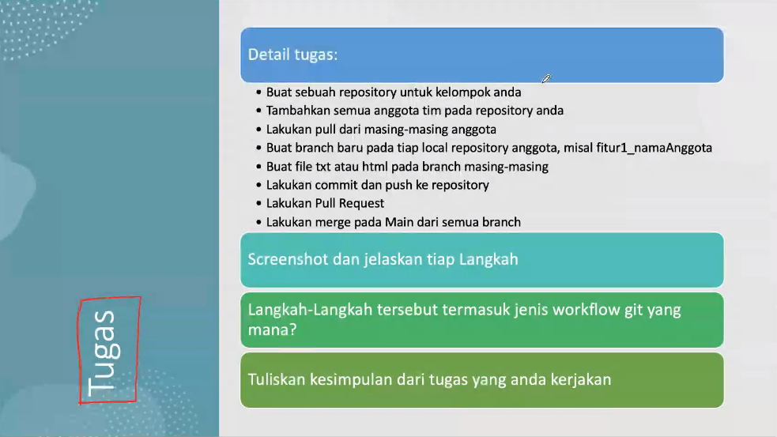

# git-workflow

Tugas 3 : Penerapan Workflow GIT Supaya Hasil Pengerjaan Group Project Jadi Lebih GGWP!

**Penting!**

1. Bikin branch baru, boleh dikasih nama apapun, ga perlu pake aturan penamaan.

2. Tambahkan file ke branch masing-masing.

3. Push ke branch yang sudah dibuat.

4. Langsung `merge` (Compare & pull request) saja.
